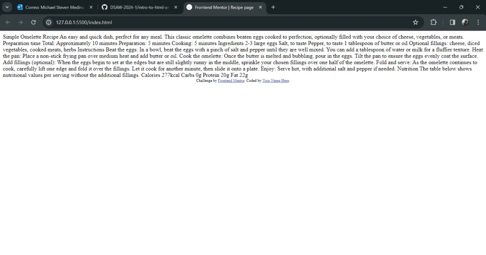
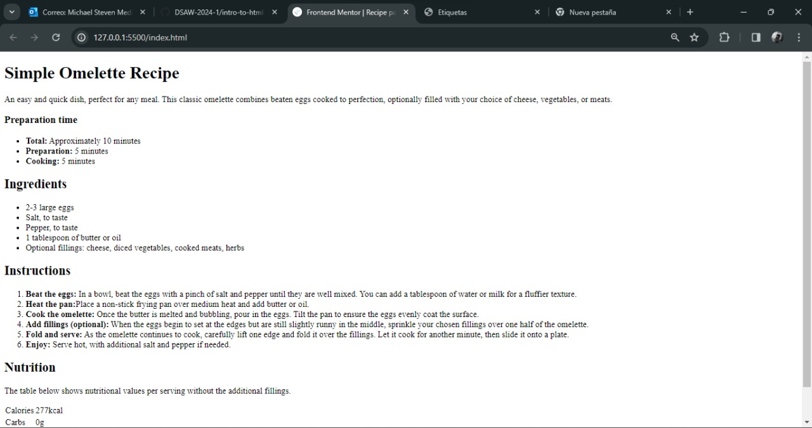
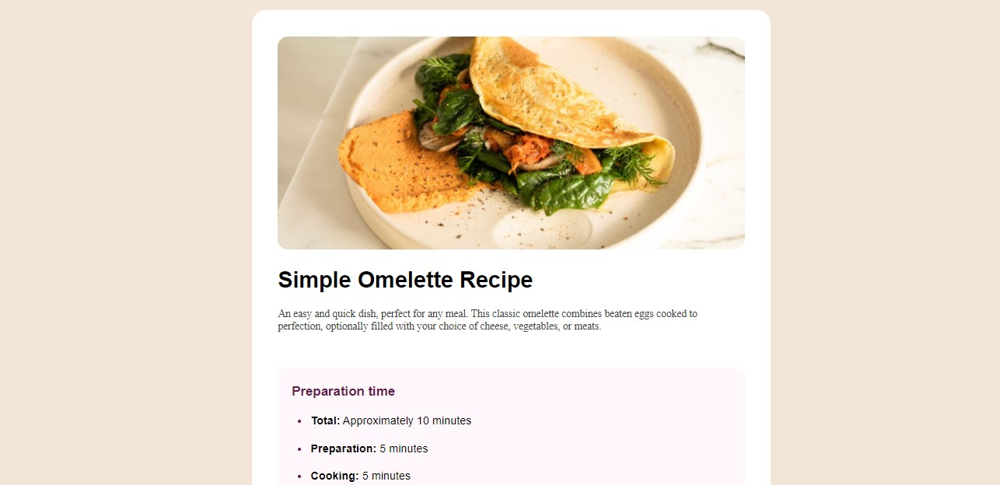
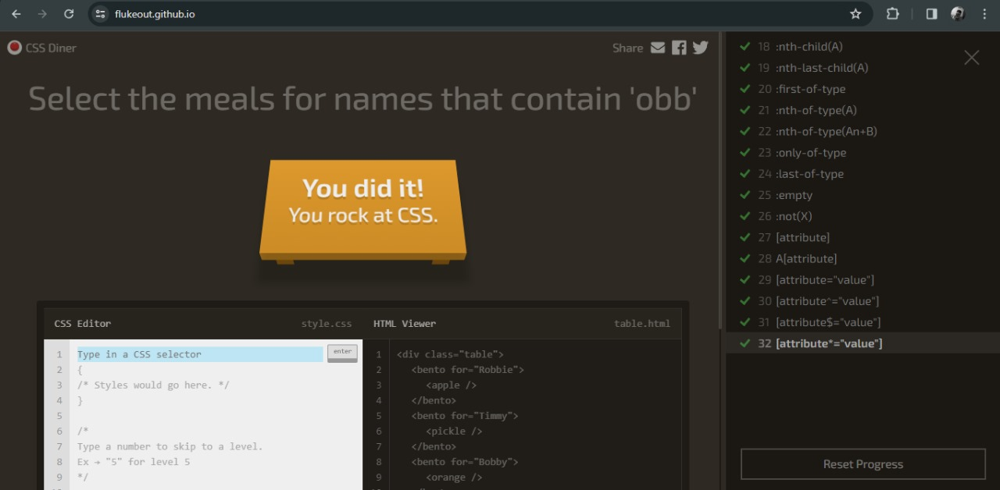

# Taller de Desarrollo Web: Página de Recetas

Bienvenido al taller de desarrollo web donde aprenderemos a crear y estilizar una página sencilla de recetas. Este taller se divide en dos partes:

## Parte 1: Desarrollo del HTML
En esta primera parte, el objetivo es desarrollar todo el HTML necesario para montar la página de recetas. Utilizaremos las etiquetas semánticas de HTML para estructurar el contenido de manera significativa. Cada receta debe tener su propia sección con título, descripción, tiempo de preparación, ingredientes, pasos a seguir y tabla nutricional.

## Parte 2: Estilos con CSS
En la segunda parte debemos generar los estilos necesarios para que la página construida se vea igual a los diseños, para esto vamos a utilizar CSS y selectores de tipo clase y de tipo ID.

# Desarrollo Taller

- Imagen antes de aplicar HTML

- Imagen despues de Aplicar HTML

- Imagen despues de aplicar estilos CSS

### Autoevaluación: 4.5
porque de lo que yo realice de forma autonoma no fue muy lejana visualmente a la pagina ni al codigo en HTML las etiquetas utilizadas de HTML en la estructura de la pagina fueron bastante acertadas de acuerdo al tipo de contenido, un error que cometi fue no utilizar los archivos que guia donde estaba el tipo de letra y los colores de cada seccion, sin embargo se intento encontrar e color exacto, en el CSS a pesar de que lo implemente bien (acertar en el estilo de cada uno de los elementos del HTML) puedo haberlo simplificado mucho mas, pero en general realice un buen trabajo.

### Link Pagina Web: [Mi primera Pagina :)](https://dsaw-2024-1.github.io/intro-to-github-pages-maikil09/)

## Sección Juegos

#### Primer juego: 
   Flexbox Froggy

   

#### Segundo juego: 
   Grid Garden

   

#### Tercer juego: 
   FlukeOut

   

## Recursos:
- En la carpeta `assets` encontrarán las fuentes y las imágenes que utilizaremos a lo largo del desarrollo.
- En la carpeta `design` encontrarán las imágenes de los diseños sobre los cuales estaremos trabajando.
   - Si bien no tenemos medidas exactas, se trata de respetar lo más posible el diseño propuesto.
- En el archivo `index.html` se encuentra el punto de inicio para el desarrollo del taller, ahí ya se encuentran los textos y la estructura básica del componente HTML. **Es indispensable que se trabaje sobre ese mismo archivo.**
- En el documento `style-guide.md` se encuentran las variables de diseño que utilizaremos para este desarrollo: esas variables incluyen tamaños y tipos de fuente, dimensiones del viewport, colores, etc.

### Créditos
- [Frontend Mentor](https://www.frontendmentor.io) challenges help you improve your coding skills by building realistic projects.

